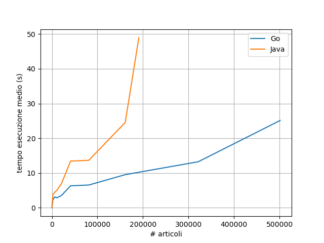
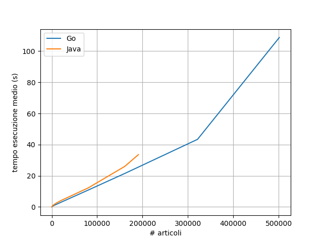

# Progetto IdS in Go

## Descrizione
Il progetto di IdS è un progetto (di gruppo) che mi è stato assegnato nel corso 
di Ingegneria del Software. 
In poche parole si trattava di scrivere in programma che permettesse 
di scaricare degli articoli da due fonti: The Guardian e New York Times.
In particolare gli articoli del The Guardian dovevano essere scaricati tramite API
mentre gli articoli del New York Times erano stati salvati in un file csv.

Il progetto originale è stato scritto in Java. Ho deciso di rifare il progetto
in Go. Le funzionalità offerte dalle due versioni sono esattamente le stesse.
L'obiettivo è quello di confrontare le prestazioni dei due progetti scritti in
due linguaggi differenti.

Riscrivendo il codice in Go mi sono accorto della sua semplicità rispetto a Java. 
La cosa che mi ha stupito particolarmente è stata la facilità nell'utilizzare le 
librerie: utilizzare le librerie per serializzazare e deserializzazare in xml, 
deserializzare da file Json, deserializzare da file csv e per gestire gli argomenti
da linea di comando è più semplice in Go rispetto a Java.

## I test
I test vengono effettuati variando il numero di articoli che vengono scaricati 
dalle sorgenti. Varia solamente il numero di articoli scaricati dal New York Times
perché le API del The Guardian hanno un numero massimo di richieste giornaliere.
Uso solamente lo stesso file csv del New York Times, questo perché 
non ho modo di ottenerne altri. 
In ogni caso non importa visto che non ho considerato i conteggi delle parole per
misurare i tempi.

Le due fasi testate sono: prima prima download poi estrazione. Nella prima fase
entrambe le soluzioni sfruttano la concorrenza: vengono lanciati diversi thread logici
(tramite `Goroutines` in Go e usando la classe `Thread` in Java).
La seconda fase è sequenziale in entrambi i progetti, l'algoritmo è pressoché identico
in entrambi i progetti.

Si tratta di stime grossolane che potrebbero non essere del tutto veritiere visto 
che il codice non è esattamente identico in entrambi i progetti, inoltre sono sicuro
che il codice possa essere migliorato e reso più efficiente. In ogni caso
si tratta di un progetto realizzato per pura noia che non ha grandi pretese.

# Risultati
Le voci:
- **N test**: numero di test totali effettuati.
- **Articoli**: totale di articoli scaricati.
- **Tempo totale**: somma dei tempi di esecuzione dei test.
- **Tempo medio**: tempo medio test (Tempo totale/N test)

## Fase di download
Dal numero totale di articoli si può risalire al numeoro di thread lanciati. 
I thread lanciati per scaricare gli articoli del The Guardian sono sempre 5 in 
entrambi i progetti. Tali thread non li consideriamo nei seguenti calcoli visto 
che terminano tutti prima della fase di download degli articoli del New York Times.

Il numero di thread lanciati nella fase di download è dato dalla formula 
$(articoli-1000)/1000$ nel caso di Java e dalla formula $(articoli-1000)/1001$ 
nel caso di Go.

### Go

|N test | Articoli  |Tempo totale | Tempo medio |  
|-------|-----------|-------------|-------------|
| 6     | 2001      |   13.41     |   2.235     |  
| 6     | 6005      |   18.77     |   3.128     |  
| 6     | 11010     |   17.22     |   2.87      |  
| 6     | 21020     |   21.23     |   3.538     |  
| 6     | 41040     |   37.96     |   6.326     |  
| 6     | 81080     |   39.29     |   6.548     |  
| 6     | 161160    |   57.22     |   9.536     |  
| 6     | 321320    |   79.44     |   13.24     |  
| 6     | 501500    |   150.86    |   25.143    |  

Il numero massimo massimo di articoli gestibile con il metodo che ho scritto è 
di circa 524 mila. Oltre tale soglia viene lanciato un'errore che dice "too many 
open files". Adottando un'altra soluzione penso si possa aggirare tale vincolo.

### Java

|N test | Articoli  | Tempo totale | Tempo medio |  
|-------|-----------|--------------|-------------|
| 6     | 2000      |    22.64     |   3.773     |  
| 6     | 6000      |    26.52     |   4.42      |  
| 6     | 11000     |    30.37     |   5.061     |  
| 6     | 21000     |    41.76     |   6.96      |  
| 6     | 41000     |    80.6      |   13.433    |  
| 6     | 81000     |    82.05     |   13.675    |  
| 6     | 161000    |    147.23    |   24.538    |  
| 6     | 191000    |    293.83    |   48.971    |  

Il numero massimo di articoli gestibile con il metodo scritto è circa 190 mila. 
Oltre a tale soglia viene generato l'errore `OutOfMemoryError` dovuto al Java Heap
Space. Anche in questo caso penso che il vincolo sia una conseguenza di come ho 
scritto il metodo.

### Grafico

## Fase di estrazione
Entrambi gli algoritimi non sfruttano la concorrenza, infatti le prestazioni non sono
ottime, penso che potrei fare di megio. Ho testato le prestazioni di questo algoritmo
perché si tratta della strategia adottata nel progetto originale.

### Go
|N test | Articoli  | Tempo totale | Tempo medio |  
|-------|-----------|--------------|-------------|
| 6     | 2001      |    3.17      |   0.528     |  
| 6     | 6005      |    6.48      |   1.08      |  
| 6     | 11010     |    10.46     |   1.743     |  
| 6     | 21020     |    18.4      |   3.066     |  
| 6     | 41040     |    34.1      |   5.6833    |  
| 6     | 81080     |    65.49     |   10.915    |  
| 6     | 161160    |    129.01    |   21.50     |  
| 6     | 321320    |    260.37    |   43.39     |  
| 6     | 501500    |    652.5     |   108.75    |  

### Java
|N test | Articoli  | Tempo totale | Tempo medio |  
|-------|-----------|--------------|-------------|
| 6     | 2000      |   5.25       |   0.875     |  
| 6     | 6000      |   9.97       |   1.661     |  
| 6     | 11000     |   15.89      |   2.648     |  
| 6     | 21000     |   25.07      |   4.178     |  
| 6     | 41000     |   41.26      |   6.876     |  
| 6     | 81000     |   73.81      |   12.301    |  
| 6     | 161000    |   156.19     |   26.031    |  
| 6     | 191000    |   201.55     |   33.591    |  

Anche per questa fase vale lo stesso discorso fatto per quella precedente:
viene generato un errore se si superano i 190 mila articoli.

### Grafico

